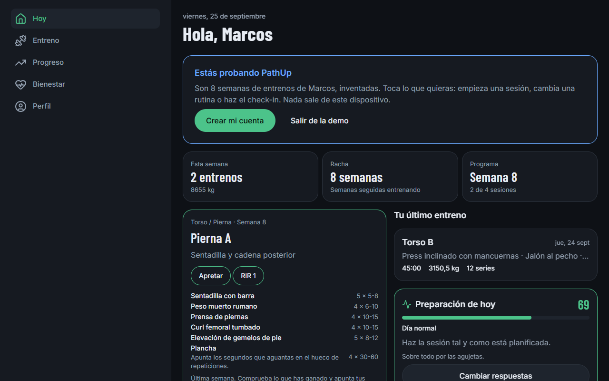
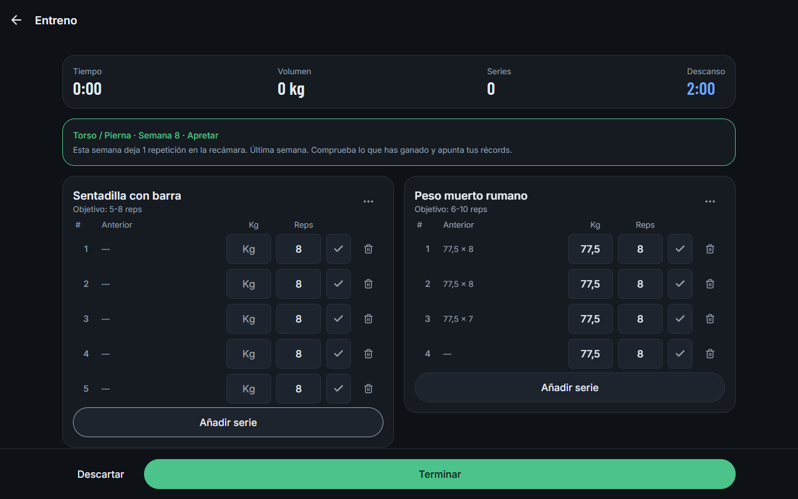
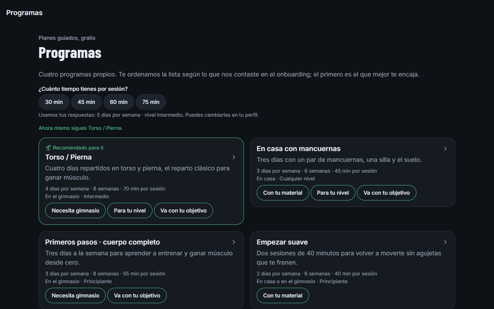
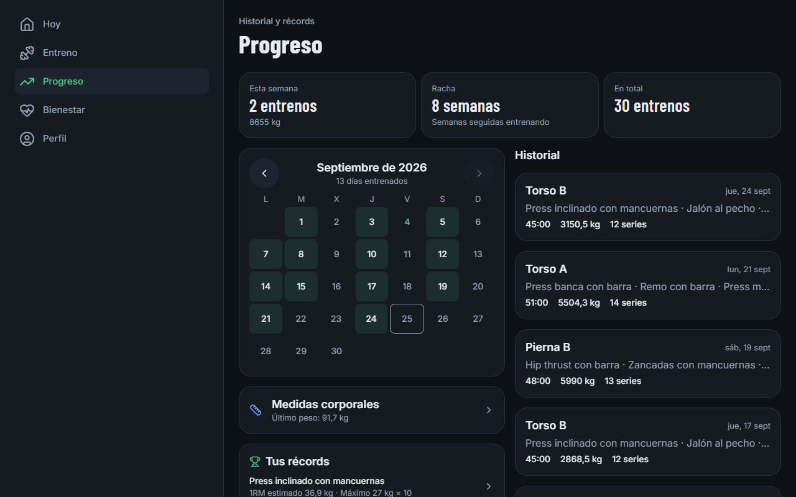
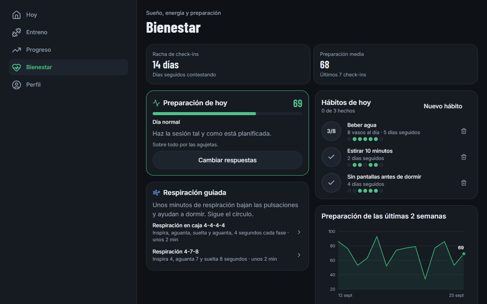
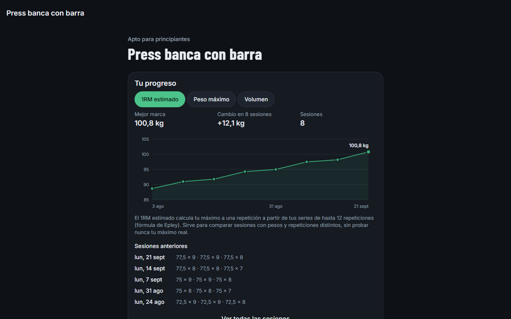
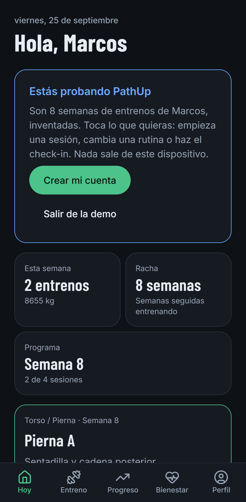
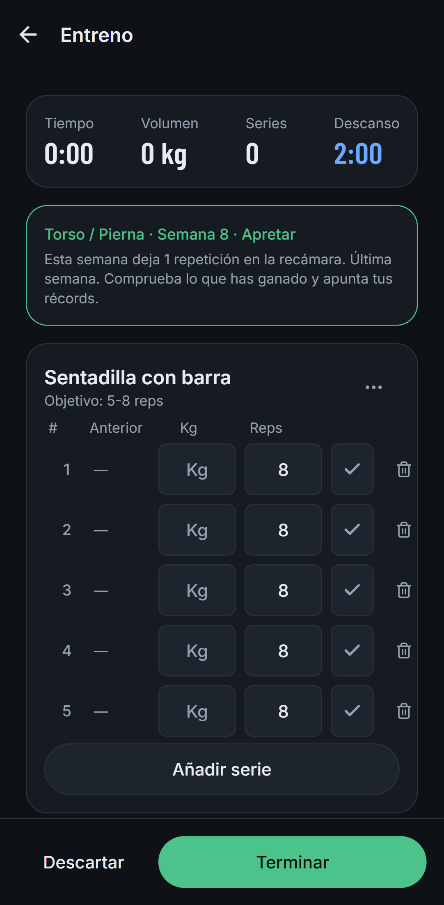
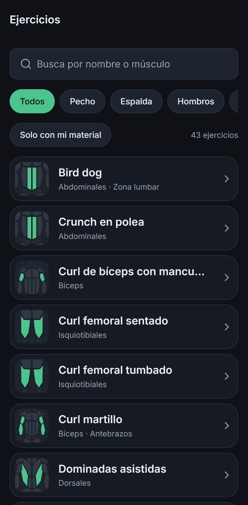
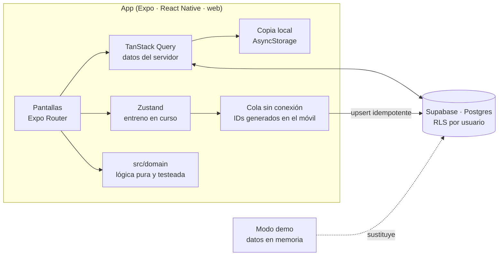

# PathUp

> **Tu camino, hacia arriba.** Entreno, programas guiados y bienestar en una sola app gratuita, en español y sin anuncios.

[](https://github.com/denislcian/pathup/actions/workflows/ci.yml)

PathUp junta lo que hoy necesita tres apps:

- el **registro de entreno** de Hevy y Strong, que funciona **sin cobertura** en el gimnasio;
- los **programas guiados** de las apps de influencers, con su porqué explicado y enlazado a los estudios;
- un **check-in de bienestar** de 20 segundos que **ajusta la sesión del día**.

Beta en construcción · MVP enseñable el 2 de noviembre de 2026 · App web instalable (PWA), Android e iPhone con el mismo código.



## Pruébala en un minuto, sin cuenta

La landing tiene un botón **«Probar sin cuenta»**: abre la app entera con 8 semanas de entrenos de ejemplo (un programa en su última semana, récords, rutinas, medidas, check-ins y hábitos). Todo vive en memoria y **nunca toca la base de datos**; hay un test que falla si lo hiciera.

```bash
npm install
npm run build:web
npx serve dist -l 3030   # abre http://localhost:3030/bienvenida
```

## Qué hace

| | |
|---|---|
|  | **Registrar un entreno.** Series con peso, repeticiones, tipo y RIR; lo de la última vez en gris (un toque lo copia); descanso automático que vibra al acabar; cambiar un ejercicio por una alternativa con tu material; notas. **Sin conexión**: la sesión sobrevive al cierre de la app y se sube sola, sin duplicados, al volver la red. |
|  | **Programas guiados.** Cuatro planes propios de 6-8 semanas, con semana de descarga. Se recomiendan según tu perfil y **se cuentan en sesiones, no en fechas**: si faltas un día, esa sesión sigue siendo la siguiente. El peso se sugiere por **doble progresión**. |
|  | **Progreso.** Calendario, racha semanal, historial, récords automáticos (1RM estimado, peso máximo, mejor serie) que salen en el resumen aunque no haya red, y gráfica por ejercicio. Medidas corporales con media de 7 días del peso. |
|  | **Bienestar.** Check-in de sueño, energía, estrés, agujetas y ánimo que da una **preparación de 0 a 100** y dice por qué; un día malo propone una serie menos (siempre se puede ignorar). Respiración guiada y hábitos con racha. |
|  | **43 ejercicios** con técnica, errores frecuentes y alternativas. Cada uno tiene un **mapa muscular dibujado por código** mientras no hay foto. |

<p>
  
  
  
</p>

## Cómo está hecha



- **Sin conexión de verdad.** Los identificadores se generan en el móvil, así que subir dos veces el mismo entreno actualiza las mismas filas en vez de duplicarlas. Lo que se ve es siempre *copia descargada + cola pendiente*.
- **Seguridad en la base de datos, no solo en la app.** Row Level Security en todas las tablas y **claves foráneas compuestas `(id, user_id)`**, porque las comprobaciones de clave foránea se saltan RLS: sin ellas, alguien podría colgar series de un entreno ajeno. Cada tabla tiene tests pgTAP que lo intentan.
- **La lógica, fuera de la interfaz.** Récords, racha, calendario, doble progresión, preparación, plan de programas y hábitos son funciones puras en `src/domain`.
- **Web de primera.** Export estático con la landing prerenderizada, *tree shaking* forzado (el bundle bajó de 4,2 a 2,4 MB), fuentes woff2, PWA instalable y menú lateral en escritorio.
- **RGPD.** Datos en la UE, consentimiento explícito para datos de salud, menores de 16 bloqueados en la app y en la base de datos, y desde el perfil puedes **descargar todos tus datos** o **borrar la cuenta** (una función `security definer` que solo puede borrar a quien la llama).

Stack: Expo SDK 57 · React Native 0.86 · React 19.2 con React Compiler · TypeScript estricto · Expo Router · TanStack Query · Zustand · Zod · i18next · react-native-svg · Supabase (Postgres, Auth, RLS) · GitHub Actions.

## Calidad

| | |
|---|---|
| **315 tests** de Jest y React Native Testing Library | Lógica de dominio y pantallas completas con el router real |
| **59 comprobaciones pgTAP** en 9 archivos | RLS, restricciones y borrado de cuenta contra un Postgres real |
| **12 pruebas E2E** con Playwright | Contra la build web de producción, en escritorio y móvil. Ya encontraron dos fallos reales: el resumen que no aparecía al terminar un entreno y los enlaces a ejercicios que daban 404 al recargar |
| **CI** en cada push | Lint, formato, tipos, tests, migraciones + pgTAP y E2E |
| **Accesibilidad** | Roles y etiquetas en todo, objetivos táctiles de 44 px o más, contraste AA, teclado en escritorio |

## Desarrollo

```bash
npm install
cp .env.example .env.local   # URL y publishable key de Supabase
npx expo start               # w para la web, Expo Go para el móvil
```

| Comando | Qué hace |
|---|---|
| `npm run check` | Lint, formato, tipos y tests, igual que el CI |
| `npm run e2e` | Build web de producción y pruebas Playwright |
| `npm run db:start` · `npm run db:test` | Postgres local en Docker y tests pgTAP |
| `SCREENSHOTS=1 npx playwright test screenshots` | Regenera las capturas de este README |

## Documentación

| Documento | Contenido |
|---|---|
| [Producto](docs/01-producto.md) | Qué copiamos de cada app y cómo lo mejoramos, público, salvaguardas |
| [Arquitectura](docs/02-arquitectura.md) | Stack, modelo de datos, estrategia sin conexión, RGPD |
| [Hoja de ruta](docs/03-hoja-de-ruta.md) | Fases con fechas, puertas y qué recortar |
| [Decisiones](docs/decisiones) | Nueve ADR: stack, web primero, paleta, historial en el móvil, rutinas sin pesos, programas, preparación… |
| [Diario](docs/diario.md) | Qué avanzó cada día |
| [Imágenes con IA](docs/05-imagenes-y-video-ia.md) | Dirección de arte y prompts de los ejercicios |
