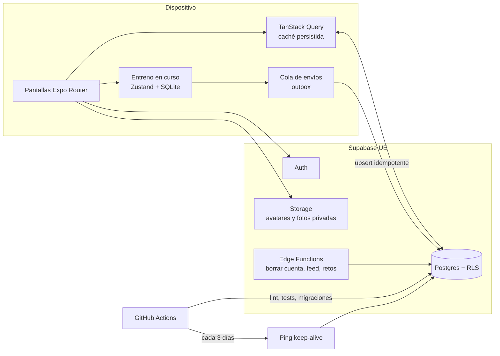

# PathUp · Arquitectura técnica

Estado: borrador v1 · 2026-09-14. Todo el stack es gratuito en el volumen de un proyecto de portfolio.

## 1. Stack y por qué

| Capa | Elección | Por qué |
|---|---|---|
| App | **Expo SDK 57** (React Native 0.86, React 19.2), **TypeScript estricto** | Una base de código para Android, iOS y web. Añade desarrollo móvil al CV |
| Navegación | **Expo Router** (rutas por archivos en `src/app`) | Estándar actual de Expo; deep links y web gratis |
| Estilos | `StyleSheet` + **tokens de diseño propios** (tema oscuro) | Cero dependencias que se rompan con cada versión del SDK |
| Datos del servidor | **TanStack Query** con caché persistida | Reintentos, caché y lectura sin conexión |
| Estado local | **Zustand** persistido en `expo-sqlite` | El entreno en curso sobrevive a cierres y a la falta de red |
| Validación y formularios | **Zod** + estado de React | Tipos compartidos entre formulario, API y tests. Se descartó react-hook-form: su resolver declara `ajv@8` como peer y rompía `npm ci` junto a ESLint |
| Traducciones | **i18next** + `expo-localization` | Español primero, inglés después |
| Backend | **Supabase** (región UE): Postgres con RLS, Auth, Storage, Edge Functions | Gratis hasta 500 MB de base de datos, 1 GB de archivos y 50.000 usuarios activos al mes |
| Esquema | Migraciones SQL versionadas con Supabase CLI + tipos TS generados | Base de datos reproducible y tipada |
| Tests | **Jest** + React Native Testing Library · pruebas de RLS con **pgTAP** en CI · **Maestro** E2E | Pirámide completa, algo que suele faltar en portfolios |
| CI/CD | **GitHub Actions** · **EAS Build** (APK) · web estática en **EAS Hosting** o Cloudflare Pages | Todo en plan gratuito |
| Errores | Sentry, plan gratuito (fase 4) | Ver fallos reales de los probadores |

**Decisiones abiertas** (se deciden al llegar a su fase):
- **Gráficas:** victory-native (Skia) o react-native-gifted-charts (SVG).
- **Web:** EAS Hosting o Cloudflare Pages.

## 2. Vista general



## 3. Cuentas en la nube y sin cobertura en el gimnasio

La cuenta es obligatoria y **Supabase es la fuente de verdad**. Aun así, en muchos gimnasios no hay cobertura, así que:

1. **Lecturas.** TanStack Query guarda en el móvil la última copia de rutinas, historial y ejercicios. La app abre y funciona sin red.
2. **El entreno en curso vive en local.** Cada serie marcada se guarda al instante en SQLite. Si la app se cierra, al volver sigue donde estaba.
3. **Al terminar**, el entreno entra en una cola (outbox) y se sube con reintentos.
4. **Idempotencia.** Los IDs (UUID) se generan en el móvil y se sube con `upsert`, así que reintentar nunca duplica un entreno.
5. **Conflictos.** Un entreno solo lo edita su dueño desde un dispositivo a la vez. Gana la última escritura, con `updated_at` como referencia.

## 4. Modelo de datos

### MVP (fases 1-3)

```text
profiles            id (= auth.users.id) · username · display_name · birth_date · sex? · height_cm?
                    units · experience_level · goal · beginner_mode · is_private · created_at
exercises           id · owner_id? (null = global) · slug · name_es · name_en · category · equipment
                    primary_muscles[] · secondary_muscles[] · instructions_es · cues_es[]
                    image_start · image_end · video? · substitutes[]
routines            id · user_id · name · folder · notes · position · updated_at
routine_exercises   id · routine_id · exercise_id · position · superset_group? · rest_seconds · notes
routine_sets        id · routine_exercise_id · position · set_type · reps_min · reps_max · target_rir? · target_weight?
programs            id · slug · name · goal · level · days_per_week · weeks · location · summary · evidence_md
program_workouts    id · program_id · week · day_index · routine_template (jsonb)
user_programs       id · user_id · program_id · started_at · current_week · current_day · status
workouts            id (UUID del móvil) · user_id · routine_id? · program_workout_id? · name
                    started_at · ended_at · notes · readiness_score? · visibility · updated_at
workout_exercises   id · workout_id · exercise_id · position · superset_group? · notes
workout_sets        id · workout_exercise_id · position · set_type · weight_kg · reps · rir? · completed_at
personal_records    user_id · exercise_id · kind (max_weight | e1rm | max_reps | max_volume) · value · workout_set_id · achieved_at
body_measurements   id · user_id · date · weight_kg? · waist_cm? · chest_cm? · arm_cm? · thigh_cm?
progress_photos     id · user_id · date · storage_path (bucket privado)
checkins            id · user_id · date (única por usuario) · sleep_hours · sleep_quality · energy · stress · mood · soreness · readiness_score · note?
habits              id · user_id · name · icon · target_per_week · archived
habit_logs          habit_id · date · done
```

### Fase 5 · Nutrición
```text
foods               id · source (usda | off | custom) · barcode? · name_es · kcal · protein · carbs · fat · fiber (por 100 g) · owner_id?
food_logs           id · user_id · date · meal · food_id · grams
saved_meals         id · user_id · name · items (jsonb)
nutrition_goals     user_id · kcal · protein_g · carbs_g · fat_g · mode (completo | solo_proteina) · updated_at
water_logs          user_id · date · ml
```

### Fase 6 · Social
```text
follows             follower_id · followee_id · status (pending | accepted) · created_at
workout_likes       workout_id · user_id
workout_comments    id · workout_id · user_id · body · created_at
challenges          id · creator_id · kind · starts_at · ends_at
challenge_members   challenge_id · user_id
reports / blocks    moderación básica
```

### Seguridad a nivel de fila (RLS)
- Todas las tablas personales: `user_id = auth.uid()` para leer y escribir.
- `exercises` y `programs` globales: lectura para cualquier usuario autenticado; escritura solo por migraciones.
- Social: un entreno se ve si `visibility = 'followers'` y existe un follow aceptado, o si es `'public'` y el perfil no es privado. **`checkins`, `body_measurements` y `progress_photos` nunca son legibles por terceros.**
- Cada política tiene su test pgTAP en CI.

## 5. Lógica de dominio (pura y testeada)

Vive en `src/domain/` como funciones puras, sin React ni Supabase, con tests unitarios.

| Función | Regla |
|---|---|
| `estimate1RM` | Epley: `peso × (1 + reps / 30)`, solo con 12 repeticiones o menos |
| `nextSetSuggestion` | **Doble progresión**: si todas las series llegan al máximo del rango con el RIR objetivo, se sube el incremento mínimo (2,5 kg en barra, 1-2 kg en mancuerna). Si no, se busca una repetición más |
| `readinessScore` | 0-100: sueño 40 % (horas y calidad), energía 20 %, estrés invertido 20 %, agujetas invertidas 20 % |
| `adjustSessionForReadiness` | 70 o más: sin cambios · 50-69: mantener pesos y RIR +1 · menos de 50: una serie menos por ejercicio o sesión ligera. **Siempre es una propuesta que el usuario puede ignorar** |
| `detectPRs` | Compara cada serie con `personal_records` al terminar el entreno |
| `calorieTarget` (fase 5) | Mifflin-St Jeor × actividad, ajuste semanal por tendencia de peso, mínimo seguro, sin déficit para menores de 18 |

Base científica: escala RIR de Helms et al. (2016) para la autorregulación; doble progresión como método estándar de sobrecarga progresiva. Las referencias completas irán en `docs/evidencia.md`.

## 6. Privacidad y RGPD

- **Datos de salud = categoría especial (art. 9 RGPD).** Se pide consentimiento explícito en el registro, con una casilla aparte y sin marcar.
- **Proyecto Supabase en región UE.**
- **Minimización**: sexo y medidas son opcionales.
- **Derechos desde la app**: exportar todos los datos (JSON y CSV) y **borrar la cuenta** con una Edge Function. Google Play exige poder borrar la cuenta dentro de la app y también desde la web.
- **Claves**:
  - En la app solo va la clave pública (anon o publishable).
  - La `service_role` (secret) solo vive en Edge Functions y en los secretos de GitHub.
  - La contraseña de la base de datos no sale nunca del gestor de contraseñas.
- **Política de privacidad y términos** publicados en la web (plantilla adaptada; no es asesoría legal).

## 7. Estructura de carpetas

```text
pathup/
├─ src/
│  ├─ app/                 rutas (Expo Router)
│  │  ├─ (auth)/           login, registro, onboarding
│  │  └─ (tabs)/           hoy · entreno · progreso · bienestar · perfil
│  ├─ components/          UI reutilizable (Button, SetRow, RestTimer…)
│  ├─ features/            workout · routines · programs · wellness · nutrition · social
│  ├─ domain/              lógica pura + tests
│  ├─ lib/                 supabase, queryClient, i18n, storage
│  ├─ theme/               tokens (colores, tipografía, espaciado)
│  └─ i18n/                es.json · en.json
├─ supabase/
│  ├─ migrations/          SQL versionado
│  ├─ seed/                ejercicios y programas
│  ├─ functions/           Edge Functions
│  └─ tests/               pgTAP (RLS)
├─ e2e/                    flujos de Maestro (YAML)
├─ assets/
│  ├─ raw/                 imágenes generadas sin procesar (no se publican)
│  └─ images/              WebP optimizadas
└─ docs/
```

## 8. Límites del plan gratuito que hay que vigilar

| Servicio | Límite | Mitigación |
|---|---|---|
| Supabase | **Pausa el proyecto tras 7 días sin actividad** | Tarea de GitHub Actions que consulta la base de datos cada 3 días |
| Supabase | 500 MB de base de datos y 1 GB de archivos | Fotos comprimidas a WebP de 1080 px o menos; ejercicios servidos desde la app, no desde Storage |
| Expo Go en iPhone | No hay versión del SDK 57 en la App Store | Probar en iPhone con la versión web; en Android, Expo Go o APK |
| EAS Build | Número limitado de builds gratuitas al mes | Construir el APK solo en versiones etiquetadas |
| Maestro | CLI local gratuita | Ejecutar en local con emulador Android; en la nube solo si hace falta |
